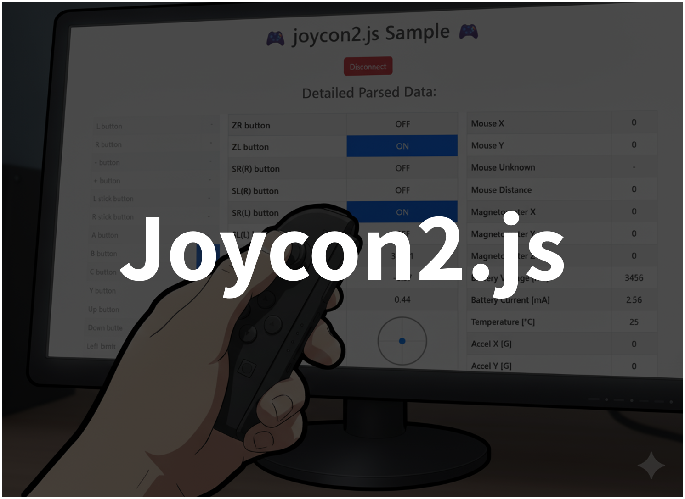
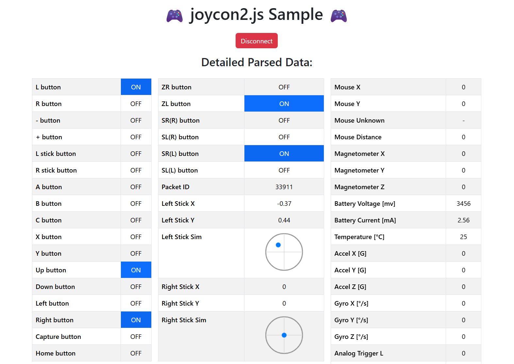

# JoyCon2.js 🎮

Version 0.7.0  
  

## Description🖊️

A monorepo containing an **UNOFFICIAL** JavaScript library for controlling `Joy-Con 2` using WebBluetooth, along with samples using Vite-based SPA WebApp and p5.js.

## Samples

- [p5.js demo](https://tetunori.github.io/joycon2.js/sample/)
  - Click to connect. Then, press X/Up button to confirm after connected.
- [SPA WebApp demo](https://tetunori.github.io/joycon2.js/example/dist/)  
  - 

## How to use🪄

### A. web usage

#### 1. Import library into HTML file
Just insert a sigle script in your `<head>`.  
```html 
<script src="https://tetunori.github.io/joycon2.js/dist/v0.7.0/joycon2.js"></script>
```

#### 2. Use this in your .js code
Call `JoyCon2()` to create an instance to access all functions.  
Then call `connect` API via received instance as below.


```javascript
const jc2 = new JoyCon2();  // Get an instance

function mouseClicked() {
  // Connect
  jc2.connect().then(() => console.log("JoyCon2 Connected"));
}
```
> [!WARNING]
> This library depends on `WebBluetooth` so that this API must be called in a user-action function like `mouseClicked()` or `keyPressed()` etc.

Then, you can access full functions after connected.
```javascript
if (jc2.buttonUp || jc2.buttonX) {
  // some button procedures...
}
```
- **[OpenProcessing Sample: joycon2.js sample](https://openprocessing.org/sketch/1716380)**
- **[p5.js demo](https://tetunori.github.io/joycon2.js/sample/)**
Click to connect. Then, press X/Up button to confirm after connected.


### B. Node.js usage
See the [SPA WebApp sample codes](https://github.com/tetunori/joycon2.js/tree/main/example/).


## APIs Specification
<details><summary>CLICK ME</summary>

## API List

- [Constructor](#Constructor)
- [Methods](#Methods)
- [Properties](#Properties)

### Constructor
```javascript
new JoyCon2()
```

Parameters: None  
  
Returns: joycon2.js instance  

### Methods
#### connect
```javascript
connect()
```

Overview:  
Connect with Joy-Con 2.

Type: `async`  
  
Parameters: None  
  
Returns: `Promise<void>`  

Notes:  
Connection success or failure can be captured using then/catch methods.
```javascript
// Consider `jc2` to be joycon2.js instance
jc2.connect()
  .then(() => {
    console.log("✅ JoyCon2 Connected");
  })
  .catch((err) => {
    console.error("❌ JoyCon2 Connection failed:", err);
  });
```

#### disconnect
```javascript
disconnect()
```

Overview:  
Disconnect from connected Joy-Con 2.

Type: `sync`  
  
Parameters: None  
  
Returns: None  
 

### Properties
Overview:  
You can access current key/button status.
```javascript
// Consider `jc2` to be connected joycon2.js instance
if (jc2.buttonUp || jc2.buttonX) {
  // some button procedures...
}
```

| Property         | Type         | Description                                  |
| ---------------- | ------------ | -------------------------------------------- |
| `packetId`       | `number`     | Packet identifier                            |
| `buttonL`        | `boolean`    | L button pressed                             |
| `buttonR`        | `boolean`    | R button pressed                             |
| `buttonMinus`    | `boolean`    | Minus (-) button pressed                     |
| `buttonPlus`     | `boolean`    | Plus (+) button pressed                      |
| `buttonLStick`   | `boolean`    | Left stick button pressed                    |
| `buttonRStick`   | `boolean`    | Right stick button pressed                   |
| `buttonA`        | `boolean`    | A button pressed                             |
| `buttonB`        | `boolean`    | B button pressed                             |
| `buttonC`        | `boolean`    | C button pressed                             |
| `buttonX`        | `boolean`    | X button pressed                             |
| `buttonY`        | `boolean`    | Y button pressed                             |
| `buttonUp`       | `boolean`    | D-Pad Up pressed                             |
| `buttonDown`     | `boolean`    | D-Pad Down pressed                           |
| `buttonLeft`     | `boolean`    | D-Pad Left pressed                           |
| `buttonRight`    | `boolean`    | D-Pad Right pressed                          |
| `buttonCapture`  | `boolean`    | Capture button pressed                       |
| `buttonHome`     | `boolean`    | Home button pressed                          |
| `buttonZR`       | `boolean`    | ZR button pressed                            |
| `buttonZL`       | `boolean`    | ZL button pressed                            |
| `buttonSR_R`     | `boolean`    | SR button (Right) pressed                    |
| `buttonSL_R`     | `boolean`    | SL button (Right) pressed                    |
| `buttonSR_L`     | `boolean`    | SR button (Left) pressed                     |
| `buttonSL_L`     | `boolean`    | SL button (Left) pressed                     |
| `leftStickX`     | `number`     | Left stick X axis (-1.0 to 1.0, normalized)  |
| `leftStickY`     | `number`     | Left stick Y axis (-1.0 to 1.0, normalized)  |
| `rightStickX`    | `number`     | Right stick X axis (-1.0 to 1.0, normalized) |
| `rightStickY`    | `number`     | Right stick Y axis (-1.0 to 1.0, normalized) |
| `mouseX`         | `number`     | Mouse movement X                             |
| `mouseY`         | `number`     | Mouse movement Y                             |
| `mouseUnknown`   | `number`     | Unknown mouse-related value                  |
| `mouseDistance`  | `number`     | Mouse movement distance                      |
| `magX`           | `number`     | Magnetometer X axis                          |
| `magY`           | `number`     | Magnetometer Y axis                          |
| `magZ`           | `number`     | Magnetometer Z axis                          |
| `batteryVoltage` | `number`     | Battery voltage                              |
| `batteryCurrent` | `number`     | Battery current (A)                          |
| `temperature`    | `number`     | Temperature in Celsius                       |
| `accelX`         | `number`     | Accelerometer X axis (g)                     |
| `accelY`         | `number`     | Accelerometer Y axis (g)                     |
| `accelZ`         | `number`     | Accelerometer Z axis (g)                     |
| `gyroX`          | `number`     | Gyroscope X axis (deg/s)                     |
| `gyroY`          | `number`     | Gyroscope Y axis (deg/s)                     |
| `gyroZ`          | `number`     | Gyroscope Z axis (deg/s)                     |
| `triggerL`       | `number`     | Left trigger value (0-255)                   |
| `triggerR`       | `number`     | Right trigger value (0-255)                  |
| `simpleParsed`   | `object`     | Simple parsed data(For Debug)                |
| `rawData`        | `Uint8Array` | Raw BLE data bytes(For Debug)                |

<p>

</p>
</details>


## Notes
### Environment 
Due to the dependency to `WebBluetooth`, this library works with the following environment.  
- OS: Windows, macOS, Android. **iOS/iPadOS does not support**(Please use [Bluefy](https://apps.apple.com/jp/app/bluefy-web-ble-browser/id1492822055) app instead). 
- Browser: Latest version of Google Chrome is highly recommended.  

You can check & use immediately via **[p5.js demo](https://tetunori.github.io/joycon2.js/sample/)**.


## Maintenance
### Development Environment
- TypeScript
- Vite
- ESLint
- Prettier
- GitHub Actions
- npm workspaces

### Directories
- `lib`: The core library (TypeScript, Vite, builds to `dist`)
- `example`: Sample SPA demonstrating library usage (Vite, TypeScript)
- `example-p5js`: Simple p5.js sample demonstrating library usage

### Build

```
npm install && npm build
```

### Confirm
#### SPA WebApp demo

```
npm run dev:example
```
Then, open `http://localhost:<port number>/` from browser.

#### p5.js demo

Open `/example-p5js/index.html` via `LiveServer` in `Visual Studio Code`.


## License⚖️

Copyright (c) 2025 [Tetsunori Nakayama](https://github.com/tetunori). MIT License.

## Author🧙‍♂️

Tetsunori Nakayama

## References📚

- [joycon2cpp](https://github.com/TheFrano/joycon2cpp) by [Frano](https://github.com/TheFrano). MIT License
- [p5.js](https://github.com/processing/p5.js) by [Processing Foundation](https://github.com/processing). GNU Lesser General Public License v2.1.

## Warning🚨

- This library is published UNOFFICIALLY, is nothing to do with the official activities and also gives any guarantees for any usage.  
- "Joy-Con 2" is a registered trademark of Nintendo Co., Ltd.