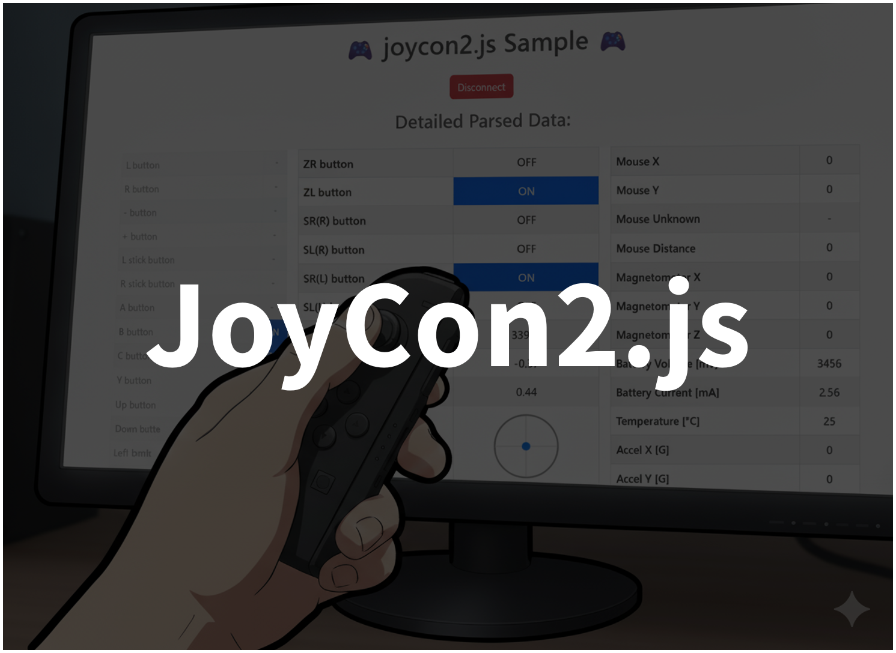
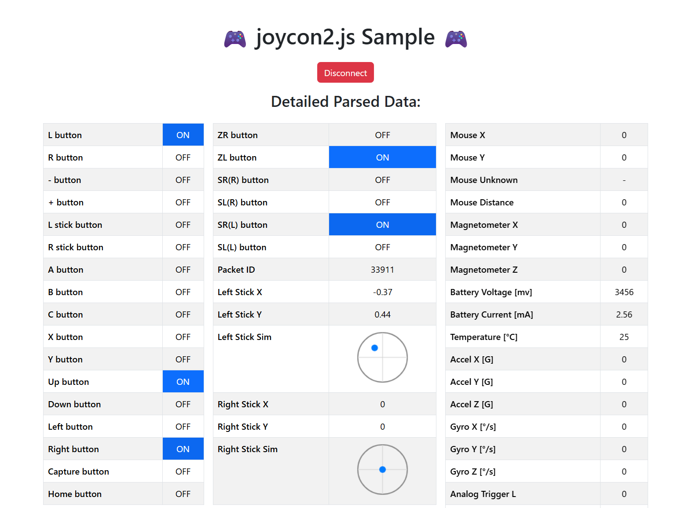

# JoyCon2.js 🎮

Version 0.7.0  
  

## Description🖊️

A monorepo containing a JavaScript library for controlling JoyCon2 using WebBluetooth, along with samples using Vite-based SPA WebApp and p5.js.

## Samples

- [p5.js demo](https://tetunori.github.io/joycon2.js/sample/)
  - Click to connect. Then, press X/Up button to confirm after connected.
- [SPA WebApp demo](https://tetunori.github.io/joycon2.js/example/dist/)  


## How to use🪄

### web usage

#### Import library into HTML file
Just insert a sigle script in your `<head>`.  
```html 
<script src="https://tetunori.github.io/joycon2.js/dist/joycon2.js"></script>
```

#### Use this in your .js code
Call `JoyCon2()` to create an instance to access all functions.  
Then call `connect` API via received instance as below.
> [!WARNING]
> This library depends on `WebBluetooth` so that this API must be called in a user-action function like `mouseClicked()` or `keyPressed()` etc.

```javascript
const jc2 = new JoyCon2();  // Get an instance

function mouseClicked() {
  // Connect
  jc2.connect().then(() => console.log("JoyCon2 Connected"));
}
```

Then, you can access full functions after connected.
```javascript
  if (jc2.buttonUp || jc2.buttonX) {
    // some button procedures...
  }
```
- **[OpenProcessing Sample: Turn Light On](https://openprocessing.org/sketch/1716380)**
- **[p5.js demo](https://tetunori.github.io/joycon2.js/sample/)**
Click to connect. Then, press X/Up button to confirm after connected.


### Node.js usage
See the [SPA WebApp sample codes](https://github.com/tetunori/joycon2.js/tree/main/example/).


## APIs Specification
<details><summary>CLICK ME</summary>
<p>

- `lib`: The core library (TypeScript, Vite, builds to `dist`)
- `example`: Sample SPA demonstrating library usage (Vite, TypeScript)
- `example-p5js`: Simple p5.js sample demonstrating library usage
</p>
</details>


## Notes
### Environment 
Due to the dependency to `WebBluetooth`, this library works with the following environment.  
- OS: Windows, macOS, Android. **iOS/iPadOS does not support**(Please use [Bluefy](https://apps.apple.com/jp/app/bluefy-web-ble-browser/id1492822055) app instead). 
- Browser: Latest version of Google Chrome is highly recommended.  

You can check & use immediately via **[p5.js demo](https://tetunori.github.io/joycon2.js/sample/)**.


## Maintenance
### Development Environment
- TypeScript
- Vite
- ESLint
- Prettier
- GitHub Actions
- npm workspaces

### Build

```
npm install && npm build
```

### Confirm
#### SPA WebApp demo

```
npm run dev:example
```
Then, open `http://localhost:<port number>/` from browser.

#### p5.js demo

Open `/example-p5js/index.html` via `LiveServer` in `Visual Studio Code`.


## License⚖️

Copyright (c) 2025 [Tetsunori Nakayama](https://github.com/tetunori). MIT License.

## Author🧙‍♂️

Tetsunori Nakayama

## References📚

- [joycon2cpp](https://github.com/TheFrano/joycon2cpp) by [Frano](https://github.com/TheFrano). MIT License
- [p5.js](https://github.com/processing/p5.js) by [Processing Foundation](https://github.com/processing). GNU Lesser General Public License v2.1.
